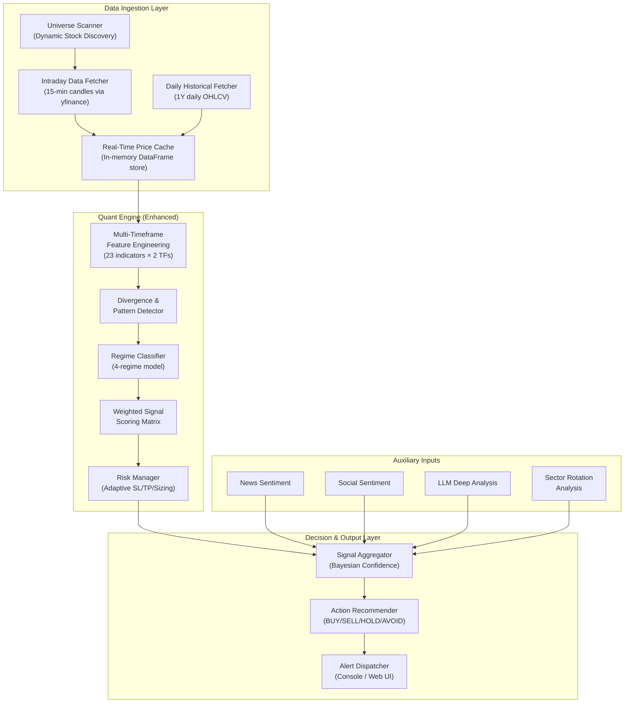
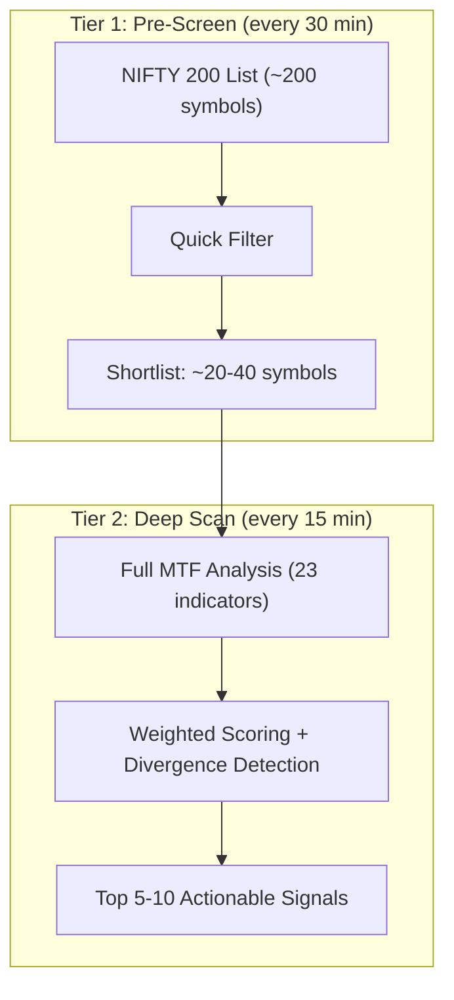
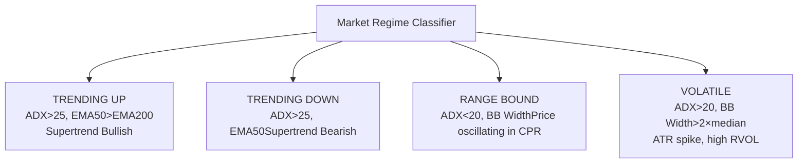
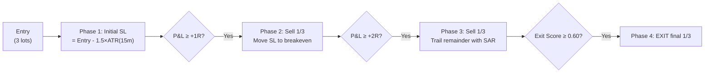

# TradeSignal Lens

AI-powered Indian stock market trading bot that combines technical analysis, news sentiment, and social media trends to generate actionable trade suggestions for NSE/BSE stocks.

## Features

- **Indian Market Data** - Real-time and historical data for NSE/BSE stocks via yfinance (free, no API key needed)
- **23 Technical Indicators** - RSI, MACD, Bollinger Bands, EMA, ATR, ADX, VWAP, Supertrend, Ichimoku Cloud, CMF, MFI, Keltner Channels, Pivot Points, Fibonacci, Parabolic SAR, OBV, Stochastic RSI, Williams %R, ROC, and more
- **15-Minute Intraday Scanning** - Multi-timeframe confluence engine (15m entries + daily trend context) with regime-adaptive signal scoring
- **4-Regime Market Classification** - Trending Up/Down, Range-Bound, Volatile — each with optimized signal weights and 3-candle transition smoothing
- **Divergence Detection** - RSI, MACD, OBV divergence engine for early reversal spotting
- **Dynamic Universe Scanning** - NIFTY 200 pre-screen for breakout candidates using volume, price, and relative strength filters
- **Persistent Portfolio Management** - Track your holdings (qty, price, SL, target) in `data/portfolio.json`; auto-loaded by scan/monitor commands
- **Hedge-Fund-Grade Risk Management**:
  - 4-phase adaptive stop-loss (initial → breakeven → trailing + SAR → weighted exit scoring)
  - Partial exits / scaling out (sell in thirds at 1R, 2R, trail remainder)
  - R:R minimum gate (blocks trades below 2:1 risk-reward)
  - Regime-adaptive position sizing (2.5% in uptrends, 1% in downtrends)
  - Daily loss limit enforcement (defense mode blocks new BUYs after 4% daily loss)
  - Correlation-aware sizing (halves position if correlation > 0.70 with existing holdings)
  - Portfolio VaR at 95% confidence, drawdown circuit breaker at 8%
- **Trade Journal & Analytics** - Persistent trade log with win rate, expectancy, Sharpe ratio, max drawdown, and adaptive risk sizing
- **Market Hours Filtering** - Suppresses BUY signals during opening/closing market buffers (first/last 15 min)
- **Gap Detection** - Detects gap-up/down > 3% and adjusts recommendations (wait for retracement / require extra confirmation)
- **Multi-Stock Ranking** - Ranks all BUY signals by composite score, allocates capital proportionally (40/35/25%) to top 3
- **Sector Rotation Analysis** - Relative strength vs NIFTY 50, sector phase classification, portfolio-level exposure limits
- **News Sentiment** - Financial news analysis from Google News RSS and NewsAPI with VADER-based sentiment scoring
- **Social Media Trends** - Reddit sentiment from Indian stock subreddits with ticker extraction
- **AI-Powered Insights** - LLM analysis (Claude / GPT) combining all signals into intelligent recommendations
- **Budget Advisor Web UI** - Flask dashboard for portfolio suggestions across stocks, ETFs, and hybrid mixes

## Project Structure

```
tradesignal-lens/
├── main.py                           # CLI entry point (12 commands + portfolio CRUD)
├── requirements.txt                  # Python dependencies
├── .env.example                      # Environment config template
├── data/
│   ├── portfolio.json                # Persistent portfolio (auto-created)
│   └── trade_journal.json            # Trade log with performance metrics
├── src/
│   ├── settings.py                   # Config: NIFTY 200 universe, sector map, risk params
│   ├── fetch_data.py                 # yfinance data fetcher
│   ├── feature_engineering.py        # 23 technical indicators
│   ├── signal_generator.py           # Regime-adaptive weighted scoring matrix
│   │
│   ├── market_data/
│   │   ├── indian_market.py          # NSE/BSE data via yfinance
│   │   ├── market_utils.py           # Market hours, holidays, IST utils
│   │   └── data_cache.py             # In-memory DataFrame cache (daily + 15m)
│   │
│   ├── quant/
│   │   ├── live_monitor.py           # Live monitoring engine v3 (15m + MTF)
│   │   ├── universe_scanner.py       # Dynamic NIFTY 200 stock discovery
│   │   ├── divergence_detector.py    # RSI/MACD/OBV divergence engine
│   │   ├── regime_classifier.py      # 4-regime classification + transition smoothing
│   │   ├── risk_manager.py           # Weighted exit scoring, R:R gate, adaptive sizing
│   │   ├── sector_analyzer.py        # Relative strength + sector rotation
│   │   ├── trade_journal.py          # Trade log, performance analytics, adaptive risk
│   │   └── correlation_engine.py     # Portfolio correlation, VaR, drawdown breaker
│   │
│   ├── news/
│   │   ├── news_fetcher.py           # Google News RSS + NewsAPI
│   │   └── sentiment_analyzer.py     # VADER sentiment with financial boosting
│   ├── social/
│   │   └── reddit_analyzer.py        # Reddit ticker extraction & sentiment
│   ├── ai_engine/
│   │   ├── llm_analyzer.py           # Claude/GPT powered stock analysis
│   │   └── signal_combiner.py        # Multi-source signal fusion
│   ├── portfolio/
│   │   ├── budget_advisor.py         # Budget-based portfolio suggestions
│   │   └── portfolio_manager.py      # Persistent portfolio CRUD + P&L tracking
│   ├── web/
│   │   ├── app.py                    # Flask web application
│   │   ├── templates/index.html      # Budget advisor UI
│   │   └── static/                   # CSS & JS assets
│   └── bot/
│       ├── orchestrator.py           # Main analysis pipeline
│       └── scheduler.py              # Market-hours-aware scheduler
```

## Setup

```bash
# 1. Clone and enter the project
git clone <repo-url>
cd tradesignal-lens

# 2. Create virtual environment
python -m venv venv
source venv/bin/activate  # Linux/Mac
# venv\Scripts\activate   # Windows

# 3. Install dependencies
pip install -r requirements.txt

# 4. Configure environment
cp .env.example .env
# Edit .env with your API keys (stock data works without any key!)
```

### API Keys

| Service | Required? | Get it from |
|---------|-----------|-------------|
| yfinance | **No key needed** | Stock data works out of the box |
| Anthropic (Claude) | Recommended | [console.anthropic.com](https://console.anthropic.com) |
| OpenAI (GPT) | Alternative | [platform.openai.com](https://platform.openai.com) |
| NewsAPI | Optional | [newsapi.org](https://newsapi.org) |
| Reddit | Optional | [reddit.com/prefs/apps](https://www.reddit.com/prefs/apps) |

Stock data via yfinance requires **no API key** and has **no rate limits**. Without LLM keys the bot falls back to rule-based analysis. News uses Google News RSS by default (no key needed).

## Usage

```bash
# Download stock data
python main.py fetch                             # all watchlist stocks
python main.py fetch --symbol RELIANCE.NS        # single stock

# Analyze a single stock
python main.py analyze RELIANCE.NS

# Scan your watchlist
python main.py watchlist
python main.py watchlist --symbols "TCS.NS,INFY.NS,SBIN.NS"

# ─── Portfolio Management ─────────────────────────────────────
# Your portfolio is saved to data/portfolio.json and auto-loaded
# by scan/monitor commands.
python main.py portfolio                                        # view portfolio with live P&L
python main.py portfolio add RELIANCE.NS 10 2500.00             # add holding
python main.py portfolio add TCS.NS 5 3800 --sl 3700 --target 4200 --notes "IT bet"
python main.py portfolio update TCS.NS --qty 10 --sl 3650       # update fields
python main.py portfolio remove RELIANCE.NS                     # remove holding
python main.py portfolio set-account 500000                     # set account value

# ─── One-shot Quant Scan (15m + daily MTF) ────────────────────
# Auto-loads your portfolio — owned stocks get HOLD/SELL/partial exit advice
python main.py scan                                             # scan default watchlist
python main.py scan --symbols "RELIANCE.NS,TCS.NS,INFY.NS"    # custom symbols
python main.py scan --universe                                  # NIFTY 200 dynamic discovery
python main.py scan --account 500000                            # custom account for sizing

# ─── Live Monitoring (the main feature!) ──────────────────────
# Auto-loads portfolio, tracks P&L, suggests partial exits
python main.py monitor                                          # monitor every 15 min
python main.py monitor --symbols "RELIANCE.NS,TCS.NS" --interval 30
python main.py monitor --once                                   # single scan, no loop

# Daily market brief
python main.py brief

# Check market status
python main.py status

# News analysis for a stock
python main.py news RELIANCE.NS

# Trending tickers on social media
python main.py trending

# Stock info
python main.py info HDFCBANK.NS

# Save reports to data/reports/
python main.py analyze RELIANCE.NS --save
python main.py watchlist --save

# Launch the budget advisor web UI
python main.py ui
python main.py ui --port 8080
```

---

# Quant Trading Architecture Workflow

> End-to-end system design: live data ingestion → advanced quant engine → actionable signals.
> Designed to match institutional-grade trading at 15-minute scan intervals.

---

## 1. System Overview



---

## 2. Data Ingestion Pipeline

### 2.1 Fetching Strategy

| Aspect | Approach |
|---|---|
| **Candle Resolution** | **15-minute** (`15m`) for entries/exits, daily for trend context |
| **Data per Cycle** | **Incremental**: only last 1-day of 15m candles per cycle |
| **Cache** | **In-memory** `dict[symbol → DataFrame]`; warm on startup |
| **Startup** | `history(period="60d", interval="1d")` + `history(period="5d", interval="15m")` |
| **Per-cycle** | `history(period="1d", interval="15m")` appended to cache |

> **yfinance constraints**: 15m candles max 60 days history; 1m candles max 7 days. No hard rate limit but aggressive parallel fetching triggers Yahoo throttling.

### 2.2 Dynamic Stock Universe Scanning



**Tier 1 Pre-Screen Criteria** (all must pass):
- Volume today > 1.5× 20-day avg daily volume
- Price within 3% of 20-day high (breakout proximity)
- ATR(14) / close > 0.8% (sufficient volatility)
- Market cap > ₹5,000 Cr
- Relative Strength vs NIFTY 50 > 1.0 (outperforming index)
- Sector is not in distribution phase (CMF > -0.05)

---

## 3. Advanced Quant Indicator Stack (23 Indicators)

| # | Indicator | 15m | Daily | Purpose |
|---|---|---|---|---|
| 1 | RSI (14) | ✓ | ✓ | Overbought/oversold timing |
| 2 | MACD (12,26,9) | ✓ | ✓ | Momentum crossover |
| 3 | EMA 9 / 21 | ✓ | — | Fast intraday trend |
| 4 | EMA 50 / 200 | — | ✓ | Golden/death cross |
| 5 | Supertrend (10, 3) | ✓ | ✓ | Trend direction filter |
| 6 | ATR (14) | ✓ | ✓ | Volatility & SL sizing |
| 7 | ADX (14) | ✓ | ✓ | Trend strength |
| 8 | VWAP | ✓ | — | Institutional fair value |
| 9 | Bollinger Bands (20, 2) | ✓ | ✓ | Squeeze & breakout |
| 10 | BB Width | ✓ | ✓ | Volatility compression |
| 11 | OBV | ✓ | ✓ | Volume flow divergence |
| 12 | Stochastic RSI (14,14,3,3) | ✓ | — | Precision OS/OB timing |
| 13 | **Ichimoku Cloud** | — | ✓ | Trend, momentum, S/R all-in-one |
| 14 | **Pivot Points (Camarilla)** | ✓ | — | Intraday support/resistance |
| 15 | **Central Pivot Range (CPR)** | ✓ | — | Narrow CPR = breakout day |
| 16 | **Chaikin Money Flow (CMF)** | ✓ | ✓ | Institutional accumulation/distribution |
| 17 | **Money Flow Index (MFI)** | ✓ | — | Volume-weighted RSI |
| 18 | **Keltner Channels** | ✓ | ✓ | Squeeze combo with BB |
| 19 | **Relative Volume (RVOL)** | ✓ | — | Smart money detection |
| 20 | **Fibonacci Retracement** | — | ✓ | Auto S/R from swing high/low |
| 21 | **Parabolic SAR** | ✓ | — | Trailing exit refinement |
| 22 | **Rate of Change (ROC, 12)** | ✓ | ✓ | Momentum oscillator |
| 23 | **Williams %R (14)** | ✓ | — | Fine-grained OB/OS |

### Key Indicator Details

#### Ichimoku Cloud (Daily)

```
Tenkan-sen (Conversion)  = (highest_high_9 + lowest_low_9) / 2
Kijun-sen (Base)          = (highest_high_26 + lowest_low_26) / 2
Senkou Span A (Leading)   = (Tenkan + Kijun) / 2, plotted 26 periods ahead
Senkou Span B (Leading)   = (highest_high_52 + lowest_low_52) / 2, plotted 26 ahead
Chikou Span (Lagging)     = close, plotted 26 periods back
```

- **Strong BUY**: Price above cloud, Tenkan > Kijun, Chikou above cloud → `+1.0`
- **Strong SELL**: Price below cloud, Tenkan < Kijun, Chikou below cloud → `-1.0`
- **Neutral**: Price inside cloud → `0.0` (no trade zone)

#### Pivot Points — Camarilla + CPR (15m)

```
R4 = close + (high - low) × 1.1/2     # Breakout resistance
R3 = close + (high - low) × 1.1/4     # Key resistance
S3 = close - (high - low) × 1.1/4     # Key support
S4 = close - (high - low) × 1.1/2     # Breakdown support

Pivot = (high + low + close) / 3
CPR_width = abs(TC - BC) / Pivot      # narrow < 0.5% = breakout day
```

#### Chaikin Money Flow (CMF, 20-period)

```
money_flow_multiplier = ((close - low) - (high - close)) / (high - low)
CMF = sum(mf_multiplier × volume, 20) / sum(volume, 20)
```

- `CMF > +0.10` → Institutional accumulation → bullish
- `CMF < -0.10` → Distribution → bearish

#### Keltner Channels + BB Squeeze (TTM Squeeze)

```
squeeze_on = bb_low > keltner_low AND bb_high < keltner_high
```

When BB contracts inside Keltner Channels, volatility is compressed. First candle where squeeze releases → high-probability breakout entry.

#### Fibonacci Auto-Retracement (Daily)

```
fib_382 = swing_high - 0.382 × range    # key pullback level
fib_618 = swing_high - 0.618 × range    # golden ratio — strongest S/R
```

---

## 4. Divergence Detection Engine

| Type | Price Action | Indicator | Signal |
|---|---|---|---|
| **Bullish Regular** | Lower Low | Higher Low (RSI/MACD/OBV) | **BUY** |
| **Bearish Regular** | Higher High | Lower High (RSI/MACD/OBV) | **SELL** |
| **Hidden Bullish** | Higher Low | Lower Low (RSI) | **BUY** (continuation) |
| **Hidden Bearish** | Lower High | Higher High (RSI) | **SELL** (continuation) |

Applied to **3 indicators** independently (RSI, MACD histogram, OBV). When 2+ align → **HIGH confidence** signal.

---

## 5. Four-Regime Market Classification



| Regime | Strategy | SL Multiplier |
|---|---|---|
| **TRENDING_UP** | Trend-following: buy pullbacks to EMA/VWAP | 1.5× ATR |
| **TRENDING_DOWN** | Avoid longs; short-sell on rallies | 2.0× ATR |
| **RANGE_BOUND** | Mean-reversion: buy at support, sell at resistance | 1.0× ATR |
| **VOLATILE** | Reduced size; only ultra-high-confidence trades | 2.5× ATR |

---

## 6. Signal Scoring Matrix (Regime-Adaptive)

| Signal | Trending↑ | Trending↓ | Range | Volatile | Base Score |
|---|---|---|---|---|---|
| MACD Cross Up (15m) | **0.15** | 0.05 | 0.10 | 0.08 | +1.0 |
| RSI < 30 (15m) | 0.08 | 0.05 | **0.18** | 0.10 | +1.0 |
| Stochastic RSI < 20 | 0.05 | 0.03 | **0.12** | 0.08 | +0.8 |
| Price > VWAP (15m) | 0.10 | 0.05 | 0.10 | 0.06 | +0.6 |
| Supertrend Bullish (daily) | **0.15** | 0.03 | 0.05 | 0.06 | +1.0 |
| Ichimoku above cloud | **0.12** | 0.03 | 0.03 | 0.05 | +1.0 |
| EMA50 > EMA200 (daily) | **0.10** | 0.03 | 0.02 | 0.04 | +0.9 |
| Volume > 1.5x avg | 0.05 | 0.05 | 0.10 | **0.12** | +0.8 |
| CMF > +0.10 | 0.05 | 0.03 | 0.08 | 0.06 | +0.7 |
| BB Squeeze Fire | 0.05 | 0.05 | **0.12** | **0.15** | +0.9 |
| RSI Bullish Divergence | 0.05 | **0.15** | 0.05 | **0.10** | +1.2 |
| OBV Divergence | 0.03 | **0.12** | 0.03 | 0.06 | +1.0 |
| Pivot S3 Bounce | 0.02 | 0.03 | **0.12** | 0.04 | +0.8 |

### Composite Score Calculation

```
score_15m  = Σ (signal_i × weight_i[regime] × score_i)
score_daily = Σ (signal_i × weight_i[regime] × score_i)

mtf_score = (score_15m × 0.6) + (score_daily × 0.4)

if divergence_detected:  mtf_score *= 1.25
rvol_multiplier = clamp(rvol / 2.0, 0.5, 1.5)
mtf_score *= rvol_multiplier

final = (0.70 × normalized) + (0.15 × news_score) + (0.15 × social_score)
```

### Decision Thresholds

| Score | Action | Confidence |
|---|---|---|
| ≥ 0.65 | **STRONG BUY** | HIGH |
| 0.40 – 0.64 | **BUY** | MEDIUM |
| 0.20 – 0.39 | **BUY (Watchlist)** | LOW |
| -0.19 – 0.19 | **HOLD / WAIT** | NEUTRAL |
| -0.45 – -0.20 | **SELL** | MEDIUM |
| ≤ -0.46 | **STRONG SELL / EXIT** | HIGH |

### Entry Quality Gate

```
entry_quality = 0
if price_near_support (within 1.5% of S3 or Fib 0.618):  +30
if rsi_15m < 45:                                          +20
if squeeze_just_fired:                                    +25
if rvol > 1.5:                                           +15
if cmf > 0:                                              +10

# Only recommend BUY if entry_quality >= 50
```

---

## 7. Adaptive Stop-Loss, Exit Scoring & Position Sizing

### Four-Phase SL/TP System with Partial Exits



### Weighted Exit Scoring (replaces single-trigger exits)

Instead of exiting on any single trigger, each exit condition has a weighted score. Exit only when the **consensus score ≥ 0.60**:

| Condition | Weight |
|-----------|--------|
| Supertrend(15m) flips bearish | 0.40 |
| Bearish divergence | 0.35 |
| RSI(15m) > 80 | 0.30 |
| Parabolic SAR above price | 0.25 |
| CMF < -0.15 | 0.20 |
| Price at Camarilla R3 | 0.15 |

### R:R Minimum Gate

All BUY signals must pass a **minimum 2:1 risk-reward** check using pivot R3 as target. Trades with insufficient R:R are downgraded to WATCHLIST.

### Regime-Adaptive Position Sizing

| Regime | Risk Per Trade | Rationale |
|--------|---------------|----------|
| TRENDING_UP | 2.5% | Ride the trend |
| RANGE_BOUND | 2.0% | Normal |
| TRENDING_DOWN | 1.0% | Defensive |
| VOLATILE | 1.0% | Preserve capital |

```
risk_amount = account_value × regime_risk_pct
stop_distance = entry_price - stop_loss
shares = floor(risk_amount / stop_distance)
max_position_value = account_value × 0.15    # never > 15% in one stock

# Correlation check: if new position corr > 0.70 with existing → halve shares
```

### Portfolio-Level Risk Controls

```
max_open_positions    = 5
max_sector_exposure   = 30%
daily_loss_limit      = 4%    → triggers defense mode (no new BUYs)
max_portfolio_drawdown = 8%   → circuit breaker (pause all new trades 24h)
max_correlation       = 0.70  → halve position if correlated with existing
portfolio_VaR_limit   = 3%    → block trades pushing VaR above 3% of account
```

---

## 8. Sector Rotation & Relative Strength

```
RS_ratio = stock_return_20d / nifty50_return_20d
```

| Sector Phase | RS Trend | Strategy | Signal Multiplier |
|---|---|---|---|
| **Leading** | RS > 1.2, rising | Overweight — buy leaders | × 1.15 |
| **Weakening** | RS > 1.0, falling | Reduce exposure | × 0.90 |
| **Lagging** | RS < 0.8, falling | Avoid | × 0.70 |
| **Improving** | RS < 1.0, rising | Watch | × 1.05 |

---

## 9. Complete 15-Minute Scan Cycle

```
┌───────────────────────────────────────────────────────────┐
│               15-MINUTE SCAN CYCLE                        │
├───────────────────────────────────────────────────────────┤
│                                                           │
│  PHASE 1: DATA REFRESH (2-3 sec)                         │
│  ├─ Fetch latest 15m candles for active watchlist         │
│  ├─ Append to in-memory cache (deduplicate)              │
│  └─ Refresh daily cache if new day                       │
│                                                           │
│  PHASE 2: UNIVERSE RE-SCREEN (every 2nd cycle)           │
│  ├─ Volume + price + RS filter on NIFTY 200              │
│  ├─ Add new passers; remove stale symbols                │
│  └─ Compute sector heat map                              │
│                                                           │
│  PHASE 3: REGIME CLASSIFICATION                          │
│  ├─ ADX + BB width + ATR ratio → 4-regime model         │
│  └─ Select regime-specific weight table                  │
│                                                           │
│  PHASE 4: MTF ANALYSIS (per symbol)                      │
│  ├─ 23 indicators on 15m + daily                         │
│  ├─ Divergence detection (RSI, MACD, OBV)               │
│  └─ Pivot point & Fibonacci levels                       │
│                                                           │
│  PHASE 5: SIGNAL SCORING                                 │
│  ├─ Weighted matrix (regime-adaptive)                    │
│  ├─ MTF confluence: (15m × 0.6) + (daily × 0.4)        │
│  ├─ Divergence boost + RVOL multiplier                   │
│  ├─ Sector rotation adjustment                           │
│  └─ Entry quality gate (≥ 50 to recommend BUY)          │
│                                                           │
│  PHASE 6: RISK MANAGEMENT                                │
│  ├─ Compute SL (4-phase adaptive)                        │
│  ├─ Position size (2% risk model)                        │
│  ├─ Portfolio-level limits                               │
│  └─ Exit triggers for owned stocks                       │
│                                                           │
│  PHASE 7: OUTPUT                                         │
│  ├─ Ranked actionable signals with entry, SL, R:R       │
│  └─ Log to JSON + update web UI                          │
│                                                           │
└───────────────────────────────────────────────────────────┘
```

---

## 10. Key Quantitative Formulas

### Risk-Reward Ratio
```
R = entry - stop_loss
Target = entry + (R × 2.5)    → minimum 2.5:1 R:R
At 40% win rate: EV = (0.40 × 2.5) - (0.60 × 1.0) = +0.40R per trade
```

### Volatility-Normalized Scoring
```
norm_momentum = momentum_5 / ATR(14)
norm_price    = (close - ema_50) / ATR(14)
```

### Sharpe-Ratio-Aware Position Weighting
```
stock_sharpe = (avg_daily_return - risk_free) / std_daily_return
position_weight = stock_sharpe / Σ(all_stock_sharpes)
```

---

## 11. Why This Achieves Hedge-Fund-Grade Logic

| Factor | Contribution |
|---|---|
| **23 indicators × 2 timeframes** | Comprehensive coverage; no blind spots |
| **Divergence detection** | Spots reversals 2-5 bars before they happen |
| **4-regime model** | Never uses trend logic in a range or vice versa |
| **Ichimoku Cloud** | Eliminates trades in equilibrium zones |
| **BB + Keltner Squeeze** | Catches volatility compression → explosive moves |
| **CMF + MFI** | Detects institutional money flow before price moves |
| **Sector rotation** | Buys leaders, avoids laggards |
| **Entry quality gate** | Prevents buying at extended prices |
| **4-phase SL** | Near-zero risk on runners; maximum profit capture |
| **Portfolio limits** | Survives drawdowns; prevents correlated blow-ups |
| **RVOL multiplier** | Weight signals by actual volume activity |
| **Fibonacci + Pivots** | Precise S/R levels from multiple methodologies |

---

## Future Roadmap

- [ ] Broker API integration (Zerodha Kite, Angel One) for live order placement
- [ ] Telegram/Discord alerts
- [ ] Options chain analysis
- [ ] FII/DII flow tracking
- [ ] Backtesting engine
- [x] Live monitoring with stop-loss tracking
- [x] Web dashboard (budget advisor UI)
- [x] yfinance migration (no API key needed)
- [x] 23 advanced quant indicators
- [x] 15-minute intraday scanning with MTF confluence
- [x] 4-regime market classification with transition smoothing
- [x] Divergence detection engine
- [x] Dynamic NIFTY 200 universe scanning
- [x] Adaptive 4-phase SL/TP system with partial exits
- [x] Sector rotation & relative strength analysis
- [x] Persistent portfolio management (add/remove/update holdings)
- [x] Trade journal with performance analytics & adaptive risk
- [x] Correlation engine (portfolio VaR, drawdown circuit breaker)
- [x] Weighted exit scoring (consensus-based, replaces single-trigger)
- [x] R:R minimum gate enforcement
- [x] Regime-adaptive position sizing
- [x] Daily loss limit with defense mode
- [x] Market hours filtering
- [x] Gap-up/gap-down detection
- [x] Multi-stock ranking with capital allocation priority

## Glossary

| Term | Meaning |
|---|---|
| **R** | One unit of risk = entry − stop-loss distance |
| **MTF** | Multi-Timeframe analysis |
| **ATR** | Average True Range — volatility measure |
| **ADX** | Average Directional Index — trend strength |
| **VWAP** | Volume Weighted Average Price |
| **Ichimoku** | Japanese cloud indicator — trend, S/R, momentum |
| **CMF** | Chaikin Money Flow — buying/selling pressure |
| **MFI** | Money Flow Index — volume-weighted RSI |
| **RVOL** | Relative Volume — current vs. average at same time |
| **CPR** | Central Pivot Range — narrow = breakout day |
| **BB Squeeze** | Bollinger inside Keltner = low vol, breakout imminent |
| **Kelly Criterion** | Optimal bet sizing from probability theory |
| **Z-Score** | Standard deviations from mean; mean-reversion |
| **RS Ratio** | Relative Strength vs. benchmark index |
| **Parabolic SAR** | Stop-And-Reverse — adaptive trailing exit |

## Disclaimer

This is an AI-powered analysis tool for educational and research purposes. It does **not** constitute financial advice. Always consult a SEBI-registered investment advisor before making trading decisions. Past performance does not guarantee future results.
